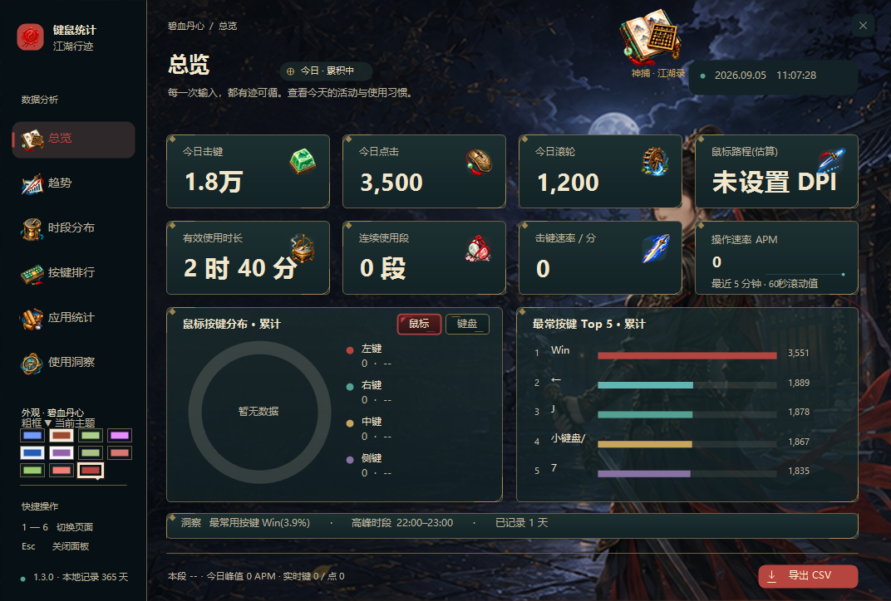
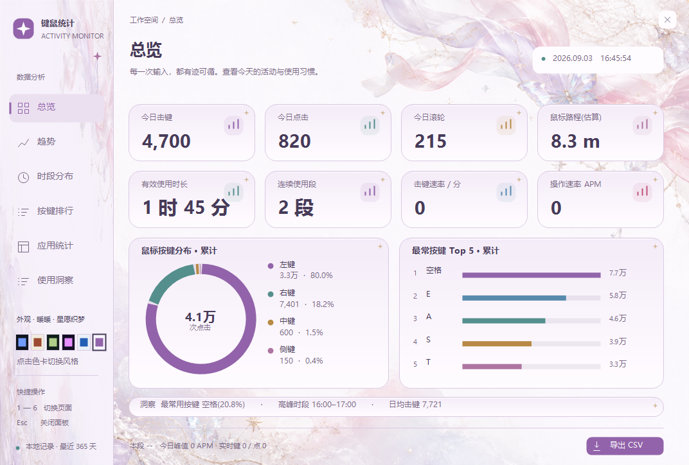
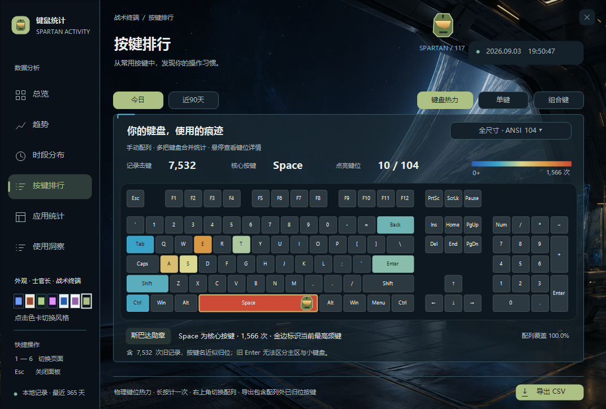
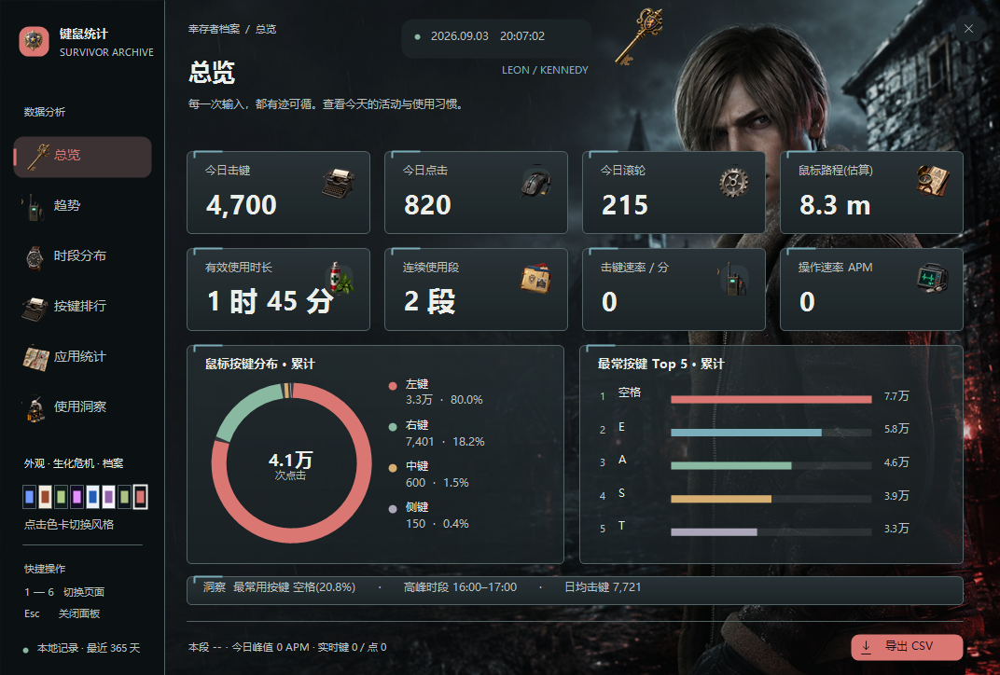
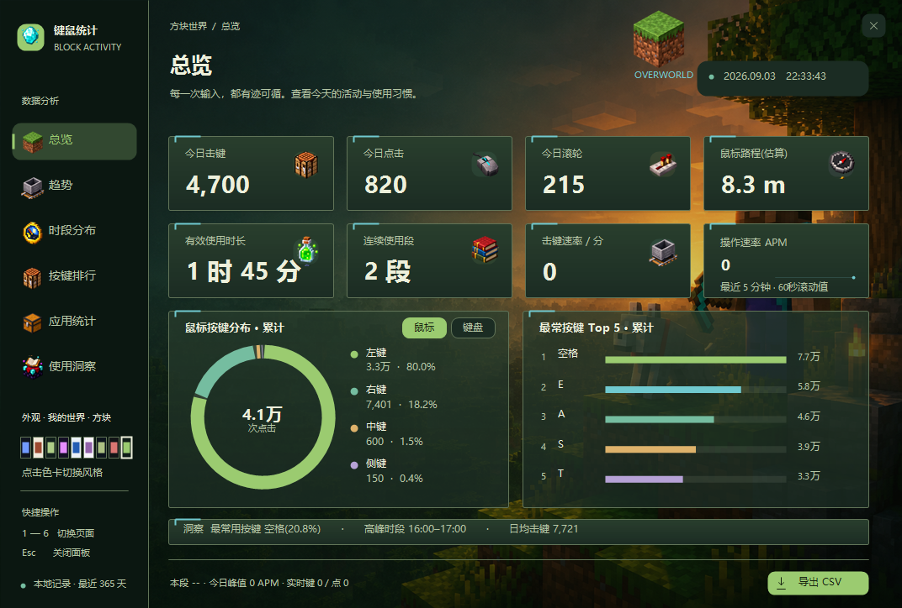

<h1 align="center">KeyMouseStats · 键鼠统计</h1>

<strong>在 Windows 桌面上记录键盘、鼠标与应用使用节奏，并把本地数据变成直观报告。</strong>

  
  
  
  

  <a href="https://github.com/2814899313/KeyMouseStats/releases/latest/download/KeyMouseStats.exe">下载完整版</a>
  · <a href="https://github.com/2814899313/KeyMouseStats/releases/latest/download/KeyMouseStats.Clean.exe">下载清爽版</a>
  · <a href="CHANGELOG.md">查看更新日志</a>
  · <a href="https://github.com/2814899313/KeyMouseStats/issues">报告问题</a>

## 它能做什么

KeyMouseStats 是一个单文件 Windows 桌面程序。悬浮小组件显示实时数据，详细面板负责回顾趋势、操作结构和使用习惯。

| 方向 | 能力 |
|---|---|
| 键盘 | 击键、逐键排行、组合键、键盘热力图、键位语义 |
| 鼠标 | 左右中侧键、滚轮、DPI 校准后的移动距离、移动方向 |
| 时间 | 活跃时长、空闲时段、连续使用段、小时分布、年度热力日历 |
| 趋势 | 按天趋势、近 2–14 天多曲线、本周七日小时曲线、异常日期标注 |
| 应用 | 前台应用归因、自定义分类、应用 × 时段、应用 × 操作、会话 × 应用 |
| 洞察 | 操作密度、快捷键节省量、历史基准、分位数和统计报告 |
| 实时 | APM、最近五分钟微趋势、当前会话时长、游戏 HUD |

> 程序统计按键次数和组合关系，不记录实际输入文字。

## 立即使用

1. 从 [Releases](https://github.com/2814899313/KeyMouseStats/releases/latest) 选择版本：
   - **KeyMouseStats.exe**：包含全部美术主题。
   - **KeyMouseStats.Clean.exe**：保留全部统计功能，不包含皮肤图片和主题切换，体积更小。
2. 放到任意可写目录后运行，无需安装。
3. 双击桌面小组件打开数据分析；右键小组件打开托盘菜单。
4. 在设置中填写鼠标 DPI，获得更接近实际值的移动距离。

Windows 首次运行可能显示“未知发布者”，因为当前版本尚未使用商业代码签名证书。

### 常用操作

| 操作 | 结果 |
|---|---|
| 单击小组件 | 切换今日 / 累计 |
| 双击小组件 | 打开数据分析 |
| 拖动小组件 | 调整桌面位置 |
| 右键小组件 | 打开功能菜单 |
| 托盘 → 窗口置顶 | 手动开启或关闭置顶，默认关闭 |
| 托盘 → 游戏 HUD | 显示游戏内实时 APM、击键与本段时长 |

## 多日小时曲线

趋势页可将同一小时的多天数据放在一张图中：

- **昨天 / 上周同日**：两条曲线直接比较。
- **近 N 天**：N 可选 2–14，每天一条独立曲线。
- **本周 7 天**：按周一至周日展示，未来日期保持为空。
- 所选日使用主题主色粗线，其他日期使用独立颜色虚线。
- 悬停曲线区域可查看各日期在同一小时的具体数值。
- CSV 以日期为列导出，便于继续分析。

## 主题

程序内置 11 套主题。主题覆盖页面背景、卡片、图标、键盘热力和加载视觉；图片采用后台加载与有界缓存。

<table>
<tr>
<td width="50%"> <b>暖暖 · 星愿织梦</b></td>
<td width="50%"> <b>士官长 · 战术终端</b></td>
</tr>
<tr>
<td width="50%"> <b>生化危机 · 生存档案</b></td>
<td width="50%"> <b>我的世界 · 方块世界</b></td>
</tr>
</table>

还包括小丑牌、大侠立志传及多套轻量配色主题。资源扩展方法见 [THEME_RESOURCES.md](THEME_RESOURCES.md)。

## 数据与隐私

- 数据只保存在当前 Windows 用户的本地应用数据目录。
- 不上传统计数据，不需要账户，也不依赖云服务。
- 默认保留最近 365 天，可从面板导出 CSV。
- 应用归因只记录前台进程、窗口标题及累计量。
- 密码输入框和实际输入内容不在统计范围内。

更详细的安全说明见 [SECURITY.md](SECURITY.md)。

## 统计口径

- **活跃**：最近一次系统输入距离当前时间小于空闲阈值。
- **连续使用段**：在阈值内持续活跃的一段时间；锁屏、休眠和较长空闲会分段。
- **鼠标距离**：Raw Input 位移结合 DPI 换算；未设置 DPI 时只能视为估算。
- **长按按键**：一次物理按下只计一次，系统自动重复不会重复累计。
- **组合键**：修饰键按住时，普通键首次按下计为一次组合动作。
- **历史基准**：至少需要 7 个有效历史日，缺失日期不会补零。

## 从源码构建

要求：Windows 10/11 与系统自带的 .NET Framework 4.x C# 编译器。

    build.bat

运行测试：

    test.bat

构建产物为根目录的 **KeyMouseStats.exe** 和 **KeyMouseStats.Clean.exe**。GitHub Actions 会在每次推送和 Pull Request 中独立构建两种版本。

## 项目导航

- [更新日志](CHANGELOG.md)
- [主题资源规范](THEME_RESOURCES.md)
- [隐私与安全](SECURITY.md)
- [参与开发](CONTRIBUTING.md)
- [1.3.5 发布说明](docs/releases/v1.3.5.md)
- [1.3.4 发布说明](docs/releases/v1.3.4.md)
- [1.3.3 发布说明](docs/releases/v1.3.3.md)
- [1.3.2 发布说明](docs/releases/v1.3.2.md)

## 参与项目

欢迎通过 [Issues](https://github.com/2814899313/KeyMouseStats/issues) 提交问题或建议。代码修改请先阅读 [CONTRIBUTING.md](CONTRIBUTING.md)，并确保没有提交个人统计数据、编译产物或批量测试截图。